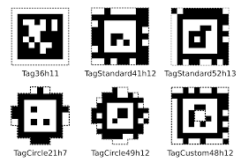
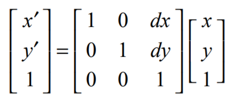
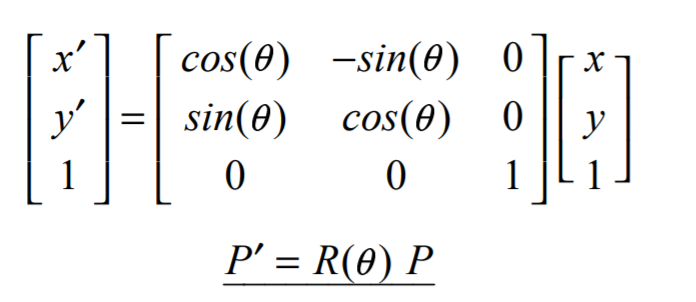
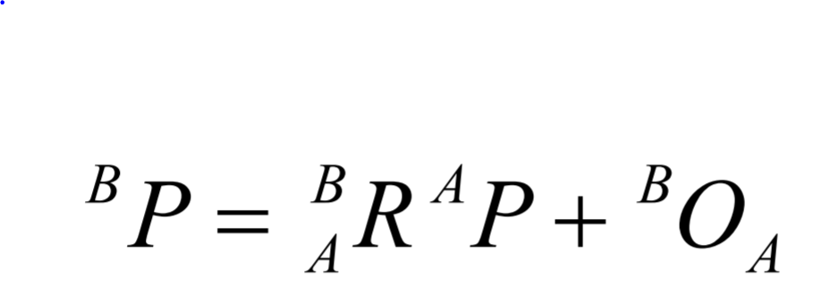
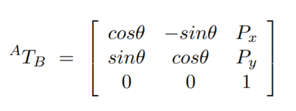
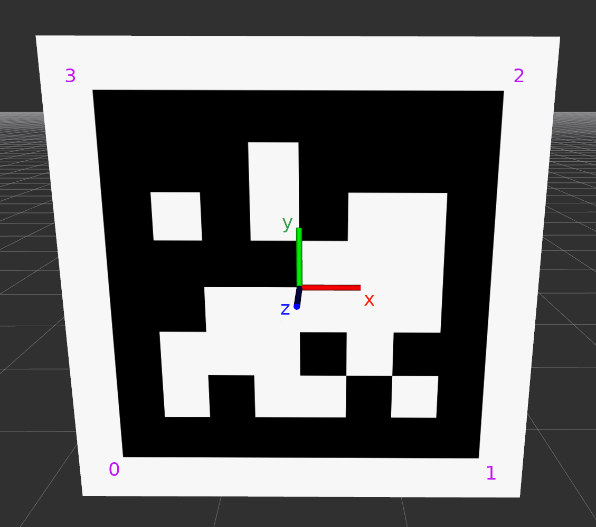

# AprilTags

Apriltags are visual markers (called fiducial markers) that acts as landmarks for the car to detect. Once these landmarks are detected, the car can localize itself on the track and infer its orientation and speed. 

###### Pre-Requisites

To use AprilTags, we need a few things:

- A camera with the associated intrinsic matrix and distortion array (See the Camera Calibration post!)
- Printed AprilTags (See the Tags Folder!)
- Python packages `pip install opencv-python pupil-apriltags`

###### Glossary

- Rigid Body-> How we think of objects in our world, with 6 degrees of freedom (3 position and 3 orientation)

- Position: The coordinates of your object in your respective frame

- Orientation: The direction your object is facing in your respective frame

- Pose: The combination of position and orientation

- Frame: The viewpoint you are in, could be the world frame, or the camera frame

- Transformation: Matrices to go from one frame to another, combining a rotation and translation matrix

- Homogenous Coordinates: A 4D representation of 3D space, (or 3D of 2D space), that allows for transformations to be represented as matrices.

- Translation Matrix: Translates position from one frame to another

  

- Rotation Matrix: Translates orientation from one frame to another

  

- Rigid Body Transformation Matrix: Combines a rotation and translation matrix 

  

- When using homogenous coordinates, this can be combined into one matrix

  

  

##### Using the AprilTags

First we need to print our AprilTags (ideally on foam board). We use the default tagStandard52h13 family of tags. Once we have them printed, we need to measure the tag size. Follow this photo guide, only measuring on the inside. Also make sure the tag is square by measuring both the height and width of the tag, otherwise it won't work. 

Next, we place them on the wall, or wherever we will go. We need to make sure the tag is correctly placed, with the correct orientation based off the photo below. 

To double check the correct orientation, take a photo and run the `visualize_image_detections()` function and confirm that the two colored corners are both on the bottom.  

### Pose Estimation and Localization

Once the AprilTags are set up, we can use them to localize the camera with respect to the tag location. If we know the tag location with respect to the track in the world coordinates, we can then place the camera (and the car) on the track! The other nice thing about working on a flat track is we can assume our Y coordinate will remain constant and work only in the 2 dimensional x-z plane.

##### World to Tag Frame

The first thing we need is the tag pose in the world frame.  To transform from one to another, we use a rigid body transformation matrix.  In practice, we use a look-up table to store all of these values as they stay static as our car moves around the track.

##### Tag Frame to Camera Location

Here is where the AprilTags come in. They give us the 3x3 rotation matrix and 3x1 translation matrix for each tag. 

##### Putting it all Together

Because we are using homogenous coordinates, we can use a composition of both 4x4 matrices to get the camera location in the world frame. 

