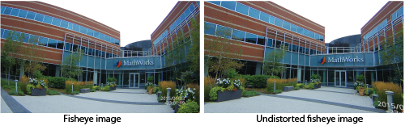

# Fisheye Camera Calibration

### Fisheye Cameras

Fisheye, or wide-angle, cameras capture a larger FOV than normal pinhole cameras, but as a side effect, lines become curves around the edges of the image.  

To use the images from a fisheye camera, we need to un-distort the image before downstream tasks. 

To correct the distortion from a fisheye image, we need the  intrinsic matrix (K) and an array of distortion coefficients (D). 

#### Intrinsic Matrix

The intrinsic matrix maps from the 3D camera coordinates to the 2D homogenous pixel values of the actual image.  The model we use has 4 parameters, two focal length parameters and two principal point offset parameters, we assume the 5th parameter *s* is 0.

##### Focal Length Parameters

The focal length parameters, f_x and f_y, allow us to convert from pixel units to real world units (e.g. cm). Most cameras have non-square pixels, so two different parameters are needed. 

##### Principal Point Offset Parameters

The principal point offset parameters, x_0 and y_0 move the origin of the camera coordinate system to the origin of the image coordinate system.

### Distortion Array

The fisheye lenses cause radial distortion, where light rays bend more near the edge of the lens compared to the center. 

To convert from the distorted coordinate to the undistorted coordinate, we use a degree-8 polynomial. 

θ_{distorted} = θ(1 + d_1 * θ^2 + d_2 * θ^4 + d_3 * θ^6 + d_4 * θ^8)

## Camera Calibration

How do we find all 8 parameters? A checkerboard! We can find 2D pixel coordinates of the corners of the squares, and if we know the size of the squares, we can get 3D camera coordinates (relative to a center point). From there we can use a least-squares optimization to solve for all the parameters. 

######  Tips for a Accurate Camera Calibration

- Take a lot of photos from a lot of different angles. You want at least 30 images of the checkerboard (50 is better!), with some close shots, some far shots and shots at all edges of the image. In addition, tilting the checkerboard forward and backwards helps the accuracy! Here are some good examples of all the different ways to move the checkerboard

- Use a very well lit room, doing this at night or from only one point source of light will hurt the accuracy of the calibration.
- Use a high quality checkerboard, a printed piece of paper will likely not be accurate enough, I'd recommend paying $5 at Fedex for them to print it onto a foam board.

